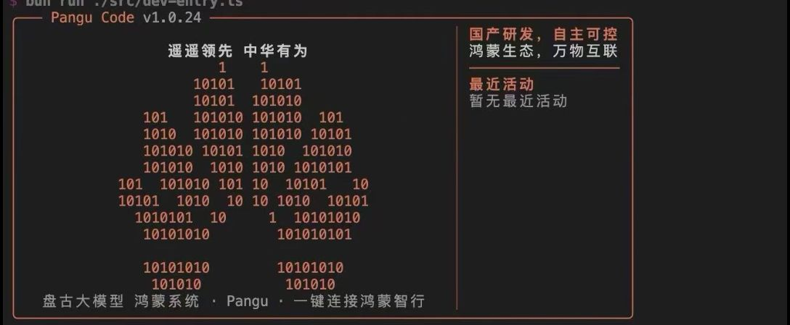

# 盘古 Code

> 遥遥领先 · 中华有为

基于 Claude Code 开源还原版本的中文本地化分支


---

## 项目简介

本项目是对 Anthropic Claude Code CLI 工具的源码还原与中文本地化改造，主要面向国内开发者使用。在保留原版完整功能的基础上，进行了以下改进：

- 启动界面全面汉化，界面文案替换为中文
- Logo 图案替换为鸿蒙风格的花型二进制图案
- 提示信息、操作引导等 UI 文字均翻译为中文
- 支持国内代理环境配置，解决网络访问问题
- 版本标识更新为 `v999.0.0-DOGE`，区分原版

---

## 快速开始

### 环境要求

| 依赖 | 最低版本 |
|------|----------|
| [Bun](https://bun.sh) | `>= 1.3.5` |
| Node.js | `>= 24.0.0` |

### 安装依赖

```bash
bun install
```

### 启动项目

```bash
# 开发模式启动
bun run dev

# 或使用 start 别名
bun run start

# 查看版本号
bun run version
```

### 全局注册命令（可选）

如需在任意项目目录下通过 `doge` 命令启动，执行以下步骤：

```bash
# 在项目根目录执行一次
bun link

# 之后在任意目录即可直接使用
doge
```

---

## 代理配置

若处于需要代理的网络环境下，复制示例配置文件并按需修改：

```bash
cp doge-install.env.example doge-install.env
```

编辑 `doge-install.env`，填入本地代理地址，例如：

```env
HTTP_PROXY=http://127.0.0.1:7898
HTTPS_PROXY=http://127.0.0.1:7898
NO_PROXY=127.0.0.1,localhost
```

---

## 项目结构

```
doge-code-main/
├── src/
│   ├── bootstrap-entry.ts      # 主入口
│   ├── main.tsx                # React TUI 根组件
│   ├── commands/               # CLI 子命令
│   ├── services/               # 后端服务层
│   ├── components/             # TUI 界面组件
│   │   └── LogoV2/             # 启动界面（Logo、提示、活动栏）
│   ├── tools/                  # AI 工具调用模块
│   └── utils/                  # 公共工具函数
├── shims/                      # 本地包兼容垫片
├── vendor/                     # 兼容性代码
├── scripts/                    # 安装脚本
├── doge-install.env.example    # 代理配置示例
└── package.json
```

---

## 汉化内容一览

| 位置 | 原文 | 汉化后 |
|------|------|--------|
| 启动标题 | `Claude Code` | `盘古 Code` |
| 顶部口号 | — | `遥遥领先 中华有为` |
| 底部说明 | — | `盘古大模型 鸿蒙系统 · 一键连接鸿蒙智行` |
| 右侧介绍 | — | `国产研发，自主可控` / `鸿蒙生态，万物互联` |
| 入门提示标题 | `Tips for getting started` | `入门提示` |
| 最近活动标题 | — | `最近活动` |
| 启动 Logo | 三角形二进制图案 | 鸿蒙花型二进制图案 |

---

## 开发说明

本仓库为还原重建的源码树，非上游原始代码。贡献代码时请遵循以下原则：

- 优先做最小化、可审计的改动
- 对任何因还原引入的 shim 或 fallback 行为需在注释中说明
- 提交信息使用简短祈使句，例如：`Fix MCP config normalization`
- PR 描述需说明用户可见的影响、还原特有的取舍及验证步骤

---

## 许可证

本项目遵循原始 Claude Code 许可协议，详见 [LICENSE.md](./LICENSE.md)。
